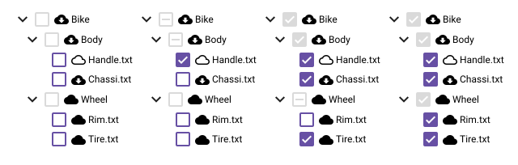

# TreeController
Utility for walking and controlling tree nodes and their state.

- install:
    - ```npm install tree-controller```
    - ```yarn add tree-controller```
- import
    - ```import { TreeController } from 'tree-controller';```
    - ```import * as TreeController from 'tree-controller';```
    - ```const TreeController = require('tree-controller');```
- Features:
  - written in typescript, exported with declaration files but contains default export for requiring;
  - [TreeController.Tree](docs/classes/TreeController.Tree-1.html): class with configurable accessors for getting a node's parent and children, so you are not tied to a single shape of node;
  - [TreeController.State](docs/classes/TreeController.State-1.html): Handles tree state independently from Tree;
  - [TreeController.Walker](docs/classes/TreeController.Walker.html): Handles walking up and down independently from Tree;
- [Docs](docs/modules/TreeController.html)

## Example use case: File Selector with status indicator
If you're building some type of file selector, you have a tree whose nodes
can be expandable/collapsible and some type of selection that should be
disabled for directories (branch nodes) but enabled for files (leaf nodes).
Also, let's suppose you want to show some kind of status, like an icon that
shows if the file is local, in the cloud or downloading, And clicking that icon
would trigger some kind of action:


That could be described using the following example:
```ts
const tree = new TreeController.Tree(Tree1.root);
const state = new TreeController.State<any, S>(
    tree,
    {
        expanded: <TreeController.State.Constructor.Params.Keys.KeyRecord<boolean>>{
            propagation: 'none',
            selection: 'branch', // allows for multiple nodes to be expanded at once
            defaultValue: false, // starts with all nodes collapsed
        },
        checked: <TreeController.State.Constructor.Params.Keys.KeyRecord<boolean>>{
            propagation: 'none',
            selection: 'multi-leaf',
            defaultValue: false, // starts with all nodes unchecked
        },
        sync: <TreeController.State.Constructor.Params.Keys.KeyRecord<'local'|'cloud'|'downloading'>>{
            propagation: 'none',
            selection: 'multi',
            defaultValue: 'local',
            values: [
                {
                    value: 'cloud',
                    nodes: [Tree1.root, Tree1.node_2, Tree1.node_2_1, Tree1.node_2_2]
                },
                {
                    value: 'downloading',
                    nodes: [Tree1.node_1, Tree1.node_1_2]
                }
            ]
        },
    },
);
```

Them setting and getting states are as simple as:
```ts
state.setState(Tree1.root, 'expanded', true);
state.setState(Tree1.root, 'checked', true);
state.setState(Tree1.root, 'sync', 'downloading');
// propagation and selection mode will be inherited from provided configuration

const rootSyncState = state.getState(Tree1.root, 'sync');
const rootState = state.getState(Tree1.root);
```

But lets suppose you want to build a custom algorithm for determining the icon
for sync. Let's make any parent that has a child downloading also show the
downloading icon. You could do that using a custom tree walking callback:
```ts
const propagateSyncFactory = (state) =>
    (node, parent, tree) => {
        const syncState = state.getState(node, 'sync');
        if (syncState !== 'downloading') state.setState(node, 'sync', 'downloading')
    }

state.setState(Tree1.node_1_1, 'sync', 'downloading');
TreeController.Walker.walkUpSyncSkipSelf(Tree1.node_1_1, tree, propagateSyncFactory(state))
```
